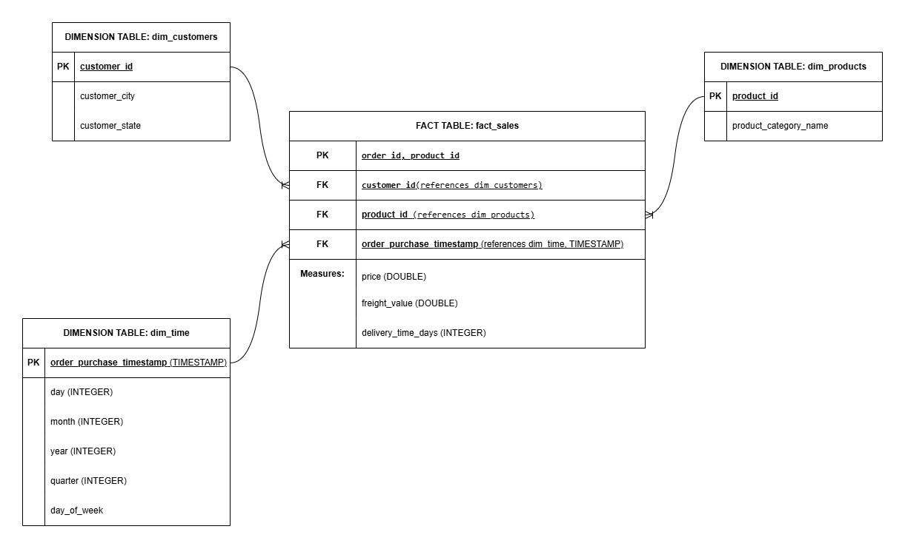

# Documentazione Modello Dati (Star Schema)

Il Layer Gold del progetto segue un'architettura a stella (Star Schema), con una Fact Table centrale e Dimension Tables collegate, ottimizzata per l'analisi delle performance di vendita e della logistica dell'e-commerce Olist.

## Schema Grafico
Il diagramma è stato progettato per garantire la centralità dei fatti numerici (fact) circondati dal contesto descrittivo (dimensions).

---

## DOMANDE DI BUSINESS:
1. **Analisi del fatturato:** Qual è il fatturato totale generato e come si distribuisce tra le diverse categorie? (price e dim_products).
2. **Distribuzione geografica:** Quali sono i primi 5 Stati per volume di ordini e valore delle vendite? (fact_sales e dim_customers).
3. **Efficienza logistica:** Quanto tempo impiegano mediamente i prodotti per arrivare a destinazione nei diversi Stati? (delivery_time_days e dim_customers).
4. **Impatto dei costi di spedizione:** Qual è l'incidenza del trasporto sulle vendite e quali Stati presentano le tariffe medie più alte? (freight_value).
5. **Andamento storico:** Come si evolvono le vendite mese dopo mese e quali sono i trend di crescita a lungo termine? (dim_time).
6. **Analisi acquisti settimanali:** In quali giorni della settimana si concentra la maggior parte degli ordini e qual è la spesa media per ogni transazione? (dim_time e fact_sales).

---

## Elenco Campi e Definizioni

### **Fact Table: `fact_sales`**
Rappresenta l'evento di vendita a livello di singolo articolo all'interno di un ordine.

- **Primary Key (PK):** `order_id`, `product_id` (chiave composta per identificare univocamente ogni riga).
- **Foreign Keys (FK):**
    - `customer_id`: collega l'evento alla dimensione clienti (`dim_customers`).
    - `product_id`: collega l'evento alla dimensione prodotti (`dim_products`).
    - `order_purchase_timestamp`: collega l'evento alla dimensione temporale (`dim_time`).
- **Measures (Misure):**
    - `price` (DOUBLE): prezzo unitario del prodotto venduto.
    - `freight_value` (DOUBLE): costo della spedizione attribuito al prodotto.
    - `delivery_time_days` (INTEGER): giorni trascorsi tra l'acquisto e la consegna effettiva al cliente.

---

### **Dimension Table: `dim_customers`**
Contiene le informazioni anagrafiche e geografiche dei clienti.

- **Primary Key (PK):** `customer_id`
- **Attributi:**
    - `customer_city`: città di residenza del cliente.
    - `customer_state`: sigla dello Stato brasiliano.

---

### **Dimension Table: `dim_products`**
Contiene i dettagli dei prodotti venduti.

- **Primary Key (PK):** `product_id`
- **Attributi:**
    - `product_category_name`: nome della categoria merceologica.

---

### **Dimension Table: `dim_time`**
Permette l'analisi dei dati su diverse scale temporali (trend).

- **Primary Key (PK):** `order_purchase_timestamp`
- **Attributi:**
    - `day` (INTEGER): giorno del mese (1-31).
    - `month` (INTEGER): mese dell'anno (1-12).
    - `year` (INTEGER): anno solare.
    - `quarter` (INTEGER): trimestre di riferimento (1-4).
    - `day_of_week` (TEXT): nome del giorno della settimana.

---

## 3. Relazioni e Cardinalità
- Tutte le relazioni tra le dimensioni e la fact table sono di tipo **1:N** (uno a molti).
- Ogni record nelle tabelle dimensionali funge da punto di ingresso unico per filtrare o raggruppare i dati aggregati nella fact table.